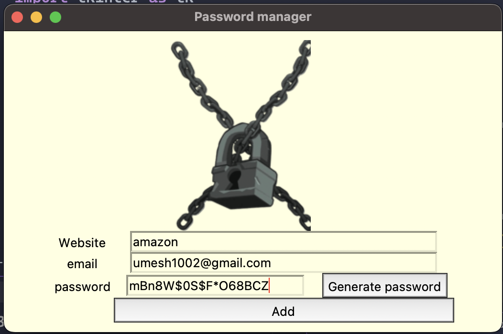
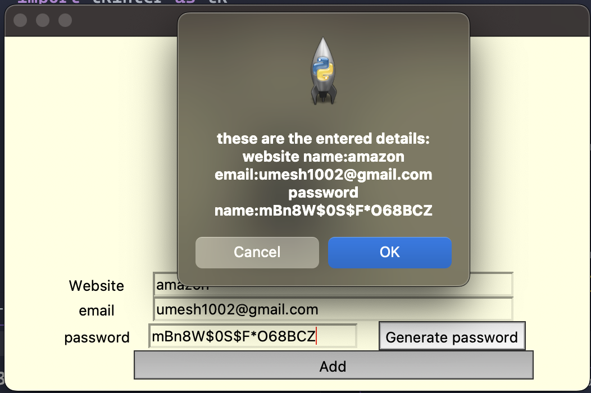
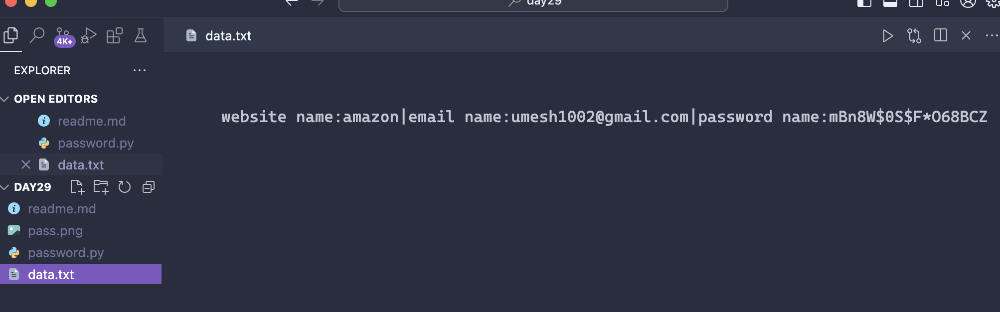

# Password Manager

## Overview

The Password Manager is a simple and intuitive tool for generating and saving passwords using Python and Tkinter. It allows users to create strong passwords and store them securely along with associated website and email information.

## Features

- **Password Generation**: Generates a random password with a mix of letters, numbers, and symbols.
- **User Interface**: Provides fields to input website name, email, and password.
- **Save Functionality**: Saves the details to a text file named `data.txt`.
- **Confirmation**: Displays a confirmation dialog before saving the details.

## Screenshots






## Getting Started

### Prerequisites

- Python 3.x
- Tkinter (usually included with Python installations)

### Installation

1. Clone this repository to your local machine:

   ```bash
   git clone https://github.com/umeshkumarsahoo/password-manager.git
   ```

2. Navigate into the project directory:

   ```bash
   cd password-manager
   ```

3. Ensure you have the required Python packages (Tkinter is included with Python by default).

### Usage

1. Open the project directory and run the `password_manager.py` file:

   ```bash
   python password_manager.py
   ```

2. The application window will open with the password manager interface. Use the **Generate Password** button to create a new password and the **Add** button to save the details.

3. Enter the website name, email, and password into the respective fields. Confirm the details in the popup dialog before they are saved to `data.txt`.

### Configuration

- **Password Length and Complexity**: The password is generated with a random combination of letters, numbers, and symbols. You can modify the generation logic in the `password_manager.py` file if needed.

### Notes

- The application uses a PNG image (e.g., `pass.png`) for visual aesthetics. Ensure the image file is available in the project directory or replace it as needed.

## Navigation

- [Overview](#overview)
- [Features](#features)
- [Screenshots](#screenshots)
- [Getting Started](#getting-started)
  - [Prerequisites](#prerequisites)
  - [Installation](#installation)
  - [Usage](#usage)
  - [Configuration](#configuration)
  - [Notes](#notes)
- [Contributing](#contributing)
- [License](#license)
- [Contact](#contact)
- [Author](#author)

## Contributing

Feel free to fork the repository, make improvements, and submit pull requests. Your contributions are welcome!

## License

This project is licensed under the MIT License. See the `LICENSE` file for more details.

## Contact

For any questions or issues, please contact me at umeshkumarsahoo@gmail.com.

## Author

This project is maintained by [Umesh Kumar Sahoo](https://github.com/umeshkumarsahoo).
