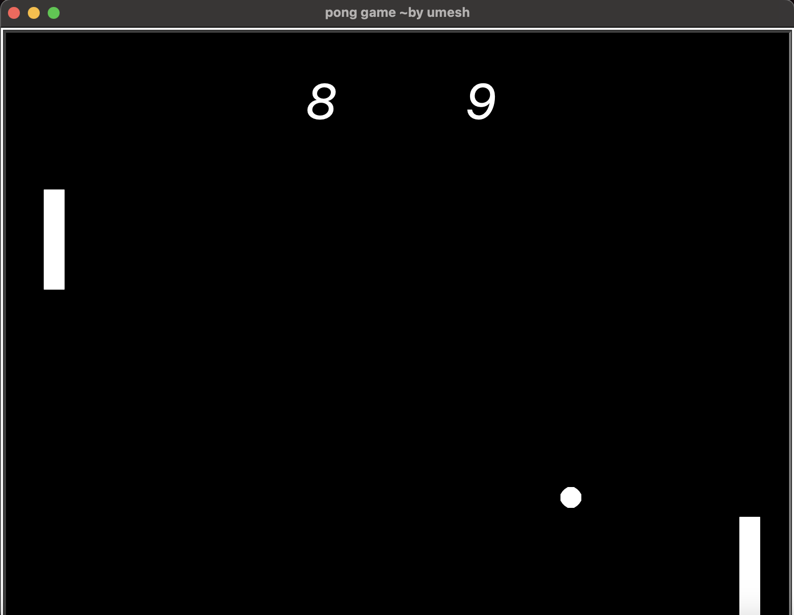

# Pong Game 🕹️

A classic Pong game implemented using Python's Turtle module. This project includes features like ball movement, paddle control, collision detection, and a score-tracking system.

## Features

- **Ball Movement:** The ball bounces off the top and bottom walls, and changes direction when it hits the paddles.
- **Paddle Control:** Two paddles controlled by the players using keyboard inputs.
- **Score Tracking:** The game keeps track of the score for both the left and right players.

## Prerequisites

Make sure you have Python installed on your system. You can download it from [Python's official website](https://www.python.org/downloads/)..

## Installation

1. **Clone the repository:**

    ```bash
    git clone https://github.com/umeshkumarsahoo/pong-game.git
    ```

2. **Navigate into the project directory:**

    ```bash
    cd pong-game
    ```

3. **Run the game:**

    ```bash
    python3 main.py
    ```

## Usage

- **Left Paddle Controls:**
  - `W` key to move up
  - `S` key to move down

- **Right Paddle Controls:**
  - `Up Arrow` key to move up
  - `Down Arrow` key to move down

## Screenshots



## Author

### Author: Umesh
### GitHub: https://github.com/umeshkumarsahoo
