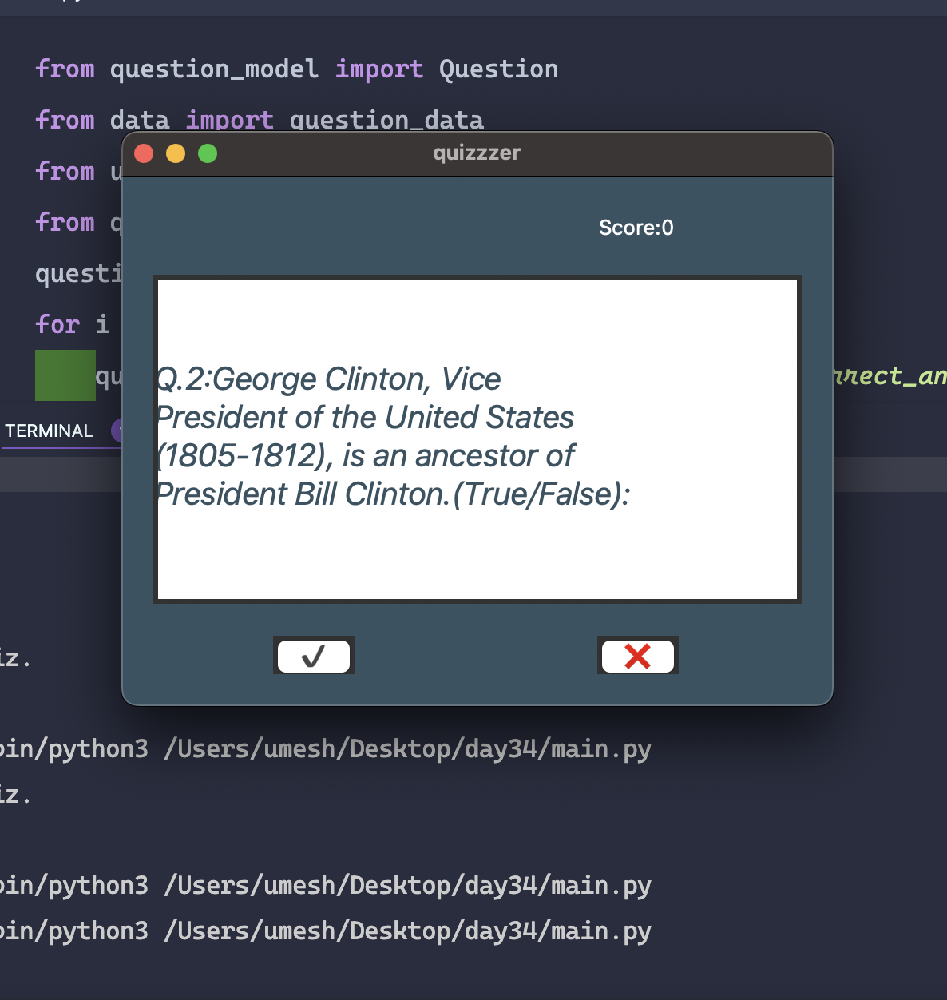

# Quiz Project

A simple quiz application built in Python.

## Description

This project is a quiz application that loads questions from a data source, presents them to the user through a user interface, and manages the quiz logic.

## Features

- Loads questions from a data source
- Presents questions through a user interface
- Keeps track of the user's score
- Provides feedback on correct/incorrect answers

## Screenshots

*Caption: The starting screen of the quiz application.*

## Project Structure

- `question_model.py`: Contains the Question class
- `data.py`: Stores the question data
- `ui.py`: Handles the user interface
- `quiz_brain.py`: Manages the quiz logic

## How to Use

1. Clone the repository
2. Ensure you have Python installed
3. Run the main script:

## Dependencies

This project uses Python's standard library and does not require any external dependencies.

## Contributing

Pull requests are welcome. For major changes, please open an issue first to discuss what you would like to change.

## License

[MIT](https://choosealicense.com/licenses/mit/)
