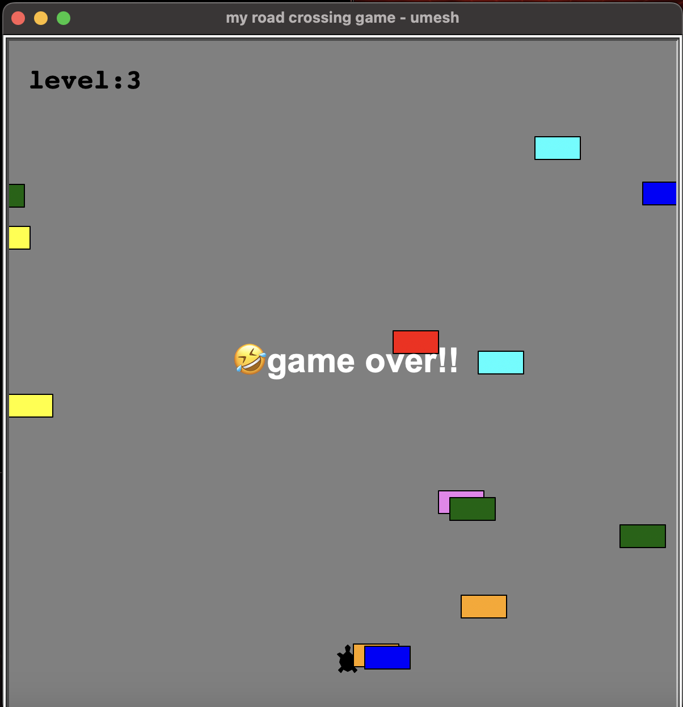

# Road Crossing Game 🐢🚗

A fun and challenging road crossing game implemented using Python's Turtle module. In this game, the player controls a turtle that must cross a busy road filled with moving cars. The goal is to reach the other side without getting hit by a car.

## Features

- **Player Movement:** Control the turtle using the up arrow key to navigate through the traffic.
- **Car Generation:** Randomly generated cars that move across the screen, with increasing speed as the player progresses.
- **Score Tracking:** Keeps track of the player's score, which increases with each successful crossing.
- **Game Over:** The game ends when the turtle collides with a car.

## Prerequisites

Make sure you have Python installed on your system. You can download it from [Python's official website](https://www.python.org/downloads/).

## Installation

1. **Clone the repository:**

    ```bash
    git clone https://github.com/your-username/road-crossing-game.git
    ```

2. **Navigate into the project directory:**

    ```bash
    cd road-crossing-game
    ```

3. **Run the game:**

    ```bash
    python main.py
    ```

## Usage

- **Control the Turtle:** Press the `Up Arrow` key to move the turtle forward.
- **Avoid Cars:** The turtle must avoid getting hit by cars while crossing the road.
- **Level Up:** Successfully crossing the road increases the game's difficulty by speeding up the cars.
- `Up Arrow` key to move up

## Screenshots



## Author

```python
# Author: Umesh
# GitHub: https://github.com/umeshkumarsahoo
