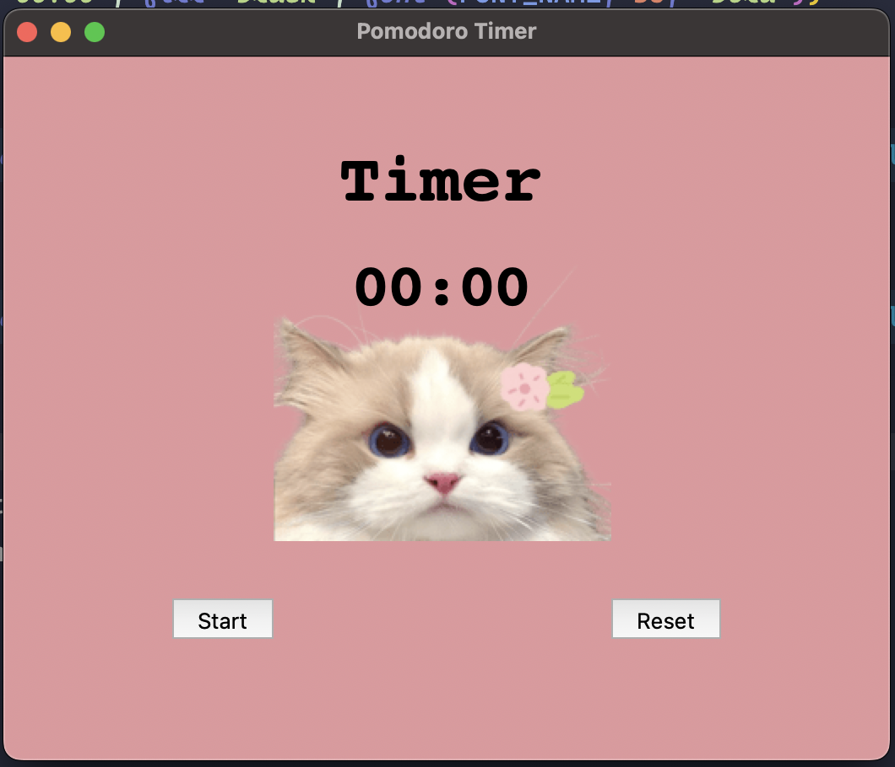
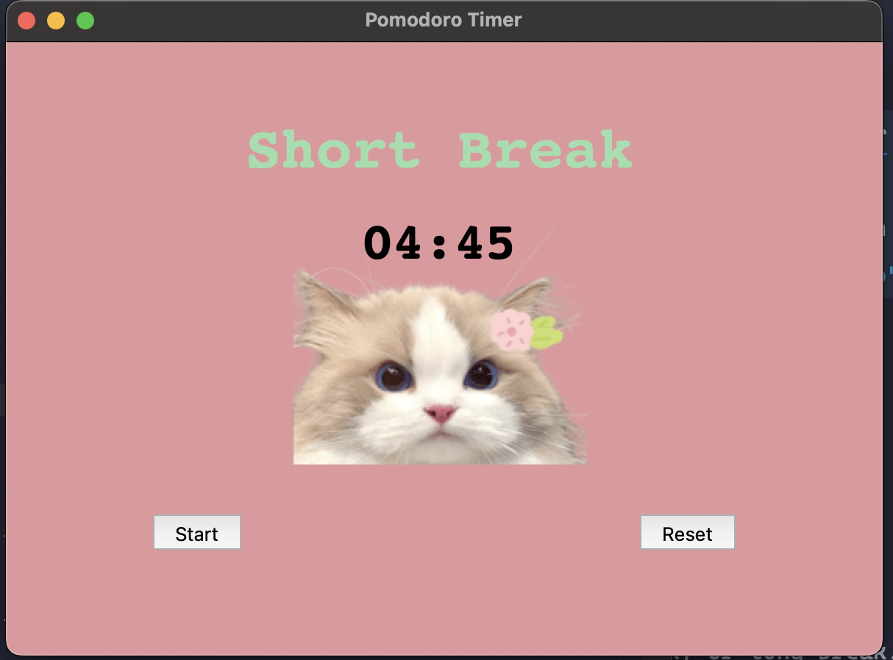

# Pomodoro Timer

## Overview

The Pomodoro Timer is a simple productivity tool built with Python and the Tkinter library. It implements the Pomodoro Technique, a time management method that encourages work in short, focused intervals with breaks in between. This timer can be used to enhance productivity and manage work sessions effectively.

## Features

- **Work Sessions**: 1-minute work intervals.
- **Short Breaks**: 5-minute intervals.
- **Long Breaks**: 20-minute intervals after every 8 work sessions.
- **Timer Display**: Shows time remaining in MM:SS format.
- **Visual Indicators**: Displays text indicating work, short break, or long break.
- **Check Marks**: Tracks completed work intervals.

## Screenshots




## Getting Started

### Prerequisites

- Python 3.x
- Tkinter (usually included with Python installations)

### Installation

1. Clone this repository to your local machine:

   ```bash
   git clone https://github.com/umeshkumarsahoo/pomodoro-timer.git
   ```

2. Navigate into the project directory:

   ```bash
   cd pomodoro-timer
   ```

3. Ensure you have the required Python packages (Tkinter is included with Python by default).

### Usage

1. Open the project directory and run the `pomodoro_timer.py` file:

   ```bash
   python pomodoro_timer.py
   ```

2. The application window will open with the timer interface. Use the **Start** button to begin the timer and the **Reset** button to reset it.

3. The timer alternates between work sessions, short breaks, and long breaks. The number of completed work sessions is indicated by check marks.

### Configuration

- **Work Interval**: Set in minutes (`WORK_MIN`).
- **Short Break Interval**: Set in minutes (`SHORT_BREAK_MIN`).
- **Long Break Interval**: Set in minutes (`LONG_BREAK_MIN`).

Edit these values in the `pomodoro_timer.py` file to customize the timer intervals.

### Notes

- The timer starts with a work session and switches to breaks as configured.
- The application uses a PNG image (e.g., `cat.png`) for visual aesthetics. Make sure the image file is available in the project directory or replace it as needed.

## Navigation

- [Overview](#overview)
- [Features](#features)
- [Screenshots](#screenshots)
- [Getting Started](#getting-started)
  - [Prerequisites](#prerequisites)
  - [Installation](#installation)
  - [Usage](#usage)
  - [Configuration](#configuration)
  - [Notes](#notes)
- [Contributing](#contributing)
- [License](#license)
- [Contact](#contact)
- [Author](#author)

## Contributing

Feel free to fork the repository, make improvements, and submit pull requests. Your contributions are welcome!

## License

This project is licensed under the MIT License. See the `LICENSE` file for more details.

## Contact

For any questions or issues, please contact me at sahooumesh2003@gmail.com

## Author

This project is maintained by [Umesh Kumar Sahoo](https://github.com/umeshkumarsahoo).
